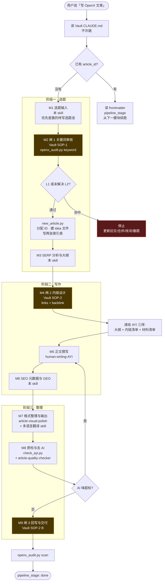
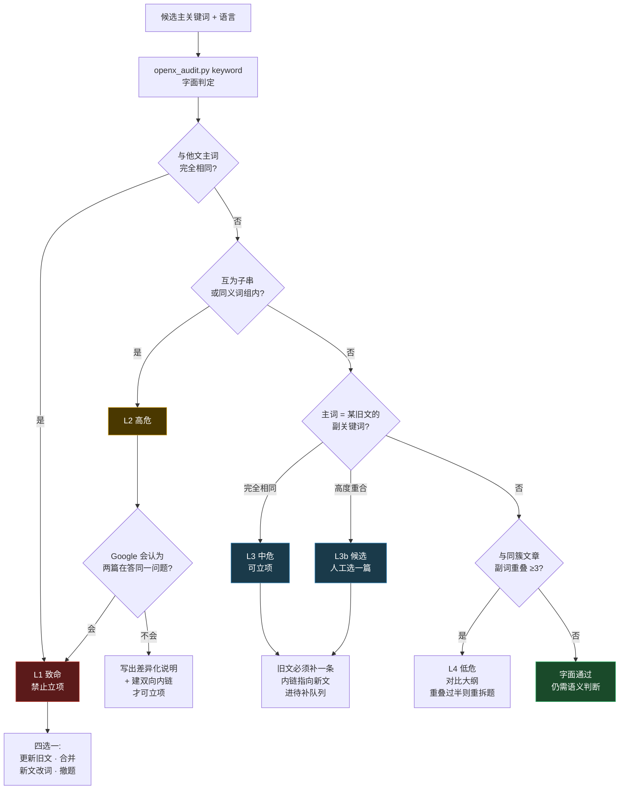
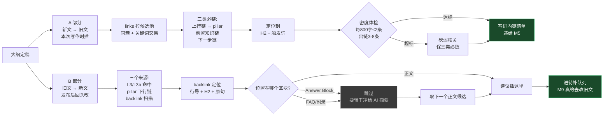

# OpenX 产文流程图

Obsidian 原生渲染 mermaid，直接看即可。三张图：主流水线、闸 1 判定树、内链双向设计。

编排 skill：`seo-writing-openx`（M1–M9）。规范来源：[CLAUDE.md](CLAUDE.md)。

**唯一入口是 M1**（从零开题）。原先并列的 C 系列旧站文章转换已于 2026-09-17 整体放弃，图与 SOP 归档在
`06-工作区/归档来源/旧站转换路线-已放弃-2026-09-17/`。

---

## 一、主流水线

**三道闸是硬拦截**：M2 未过不写大纲，M4 未做不写正文，M9 未做不算交付。

---

## 二、闸 1 · 关键词冲突判定树

**L3 不是问题，是机会**——旧文本来就在谈这个话题，正需要一篇专文来接。
它把「潜在冲突」直接转成「一条该做的内链」，是整套系统最大的价值来源。

---

## 三、闸 2 · 内链双向设计

**待补队列非空 = 上一篇没交付完。** 开新文前先清。

多语言：内链关系只在源语言层设计一次，各语言版本继承，只换锚文本。
目标文章的该语言版本不存在 → 删掉那条链接（保留句子），进待补队列，等它上线补回来。

---

## 四、C 系列 · 旧站文章转换（已放弃）

2026-09-17 决定：不再从 1000X 旧站取材，OpenX 只做新文章。原流程图、SOP-6 与 60 篇素材整体归档于
[旧站转换路线-已放弃-2026-09-17](06-工作区/归档来源/旧站转换路线-已放弃-2026-09-17/README.md)。
当时在 C3 阶段跑出的台湾繁中取词与 SERP 数据仍有效，保留在 `06-工作区/C3-取词/`，作为闸 1 选题输入。
